# SVG Graphic Editor -- Diagrams

All diagrams use Mermaid syntax for GitHub rendering.

---

## 1. Use Case Diagram

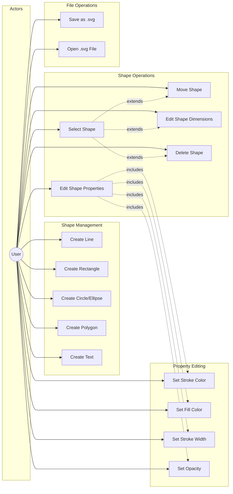

---

## 2. Component Architecture Diagram

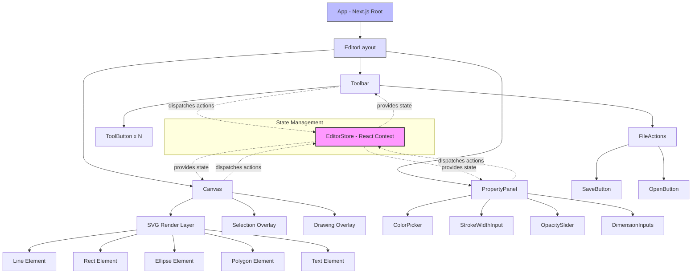

---

## 3. State Flow Diagram

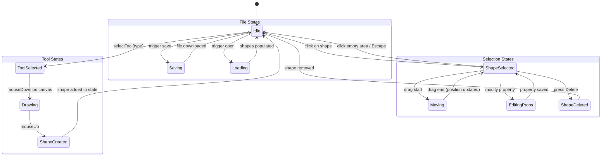

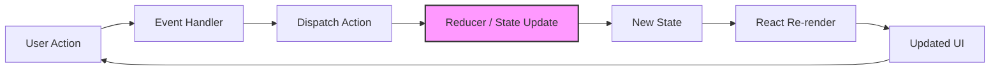

---

## 4. Sequence Diagrams

### 4a. Create Shape Flow

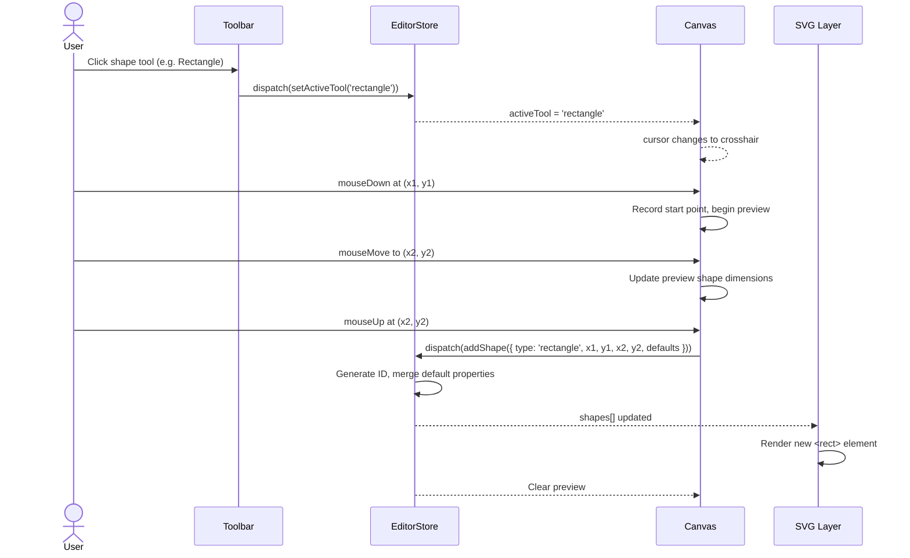

### 4b. Edit Shape Flow

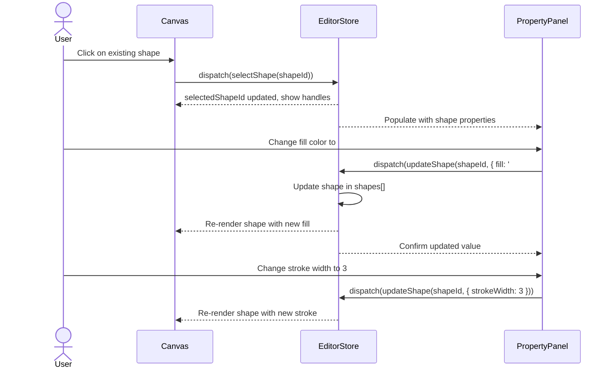

### 4c. Save File Flow

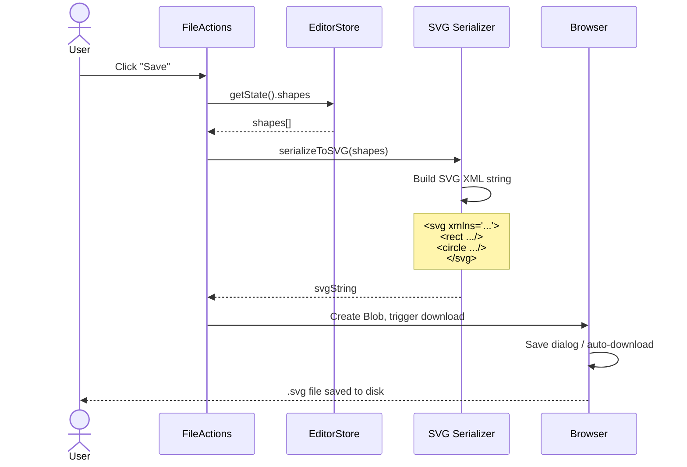

### 4d. Open File Flow

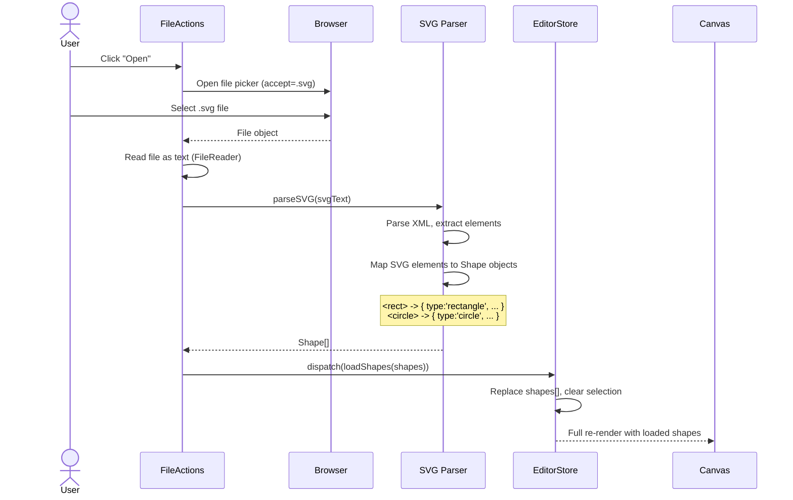

---

## 5. Class/Type Diagram

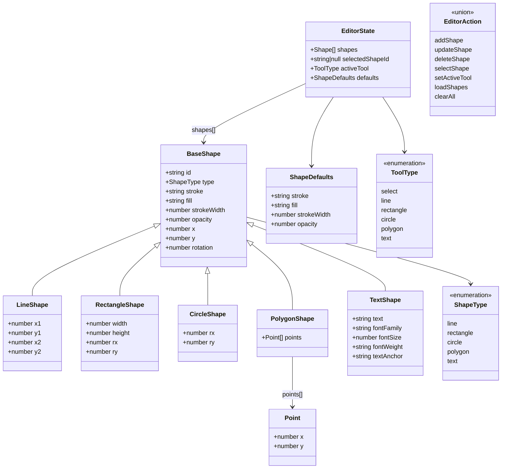

---

## 6. UI Wireframe

```
+---------------------------------------------------------------+
|  SVG Graphic Editor                              [Save] [Open] |
+---------------------------------------------------------------+
|       |                                           |            |
|  T    |                                           |  Property  |
|  O    |                                           |  Panel     |
|  O    |                                           |            |
|  L    |            Canvas (SVG)                   | ---------- |
|  B    |                                           | Stroke: __ |
|  A    |        +--------+                         | Fill:   __ |
|  R    |        |  Rect  |    /\                   | Width:  __ |
|       |        |        |   /  \                  | Opacity:__ |
| ----- |        +--------+  /____\                 |            |
| [Sel] |                                    Hello  | ---------- |
| [Lin] |           .---.                           | Position   |
| [Rec] |          /     \                          | X: ___     |
| [Cir] |         (       )                         | Y: ___     |
| [Pol] |          \     /                          | W: ___     |
| [Txt] |           '---'                           | H: ___     |
|       |                                           |            |
+-------+-------------------------------------------+------------+
|  Status: Rectangle Tool selected                               |
+---------------------------------------------------------------+
```

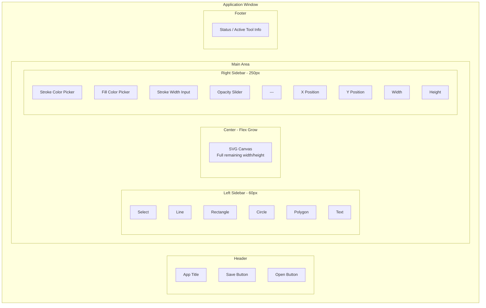

---

## 7. CI/CD Pipeline Diagram

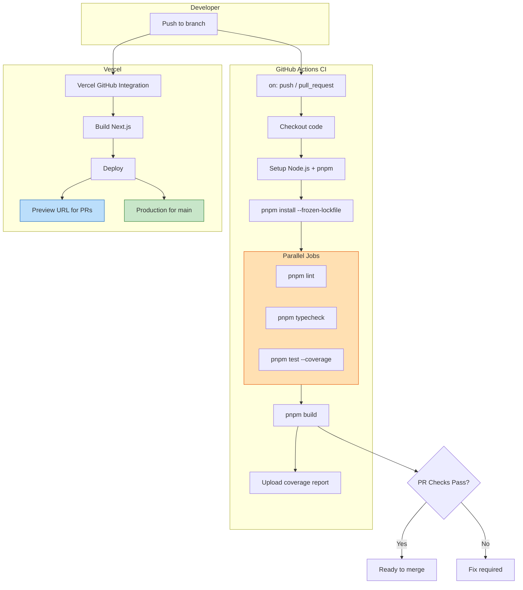

---

## 8. Development Phase Diagram

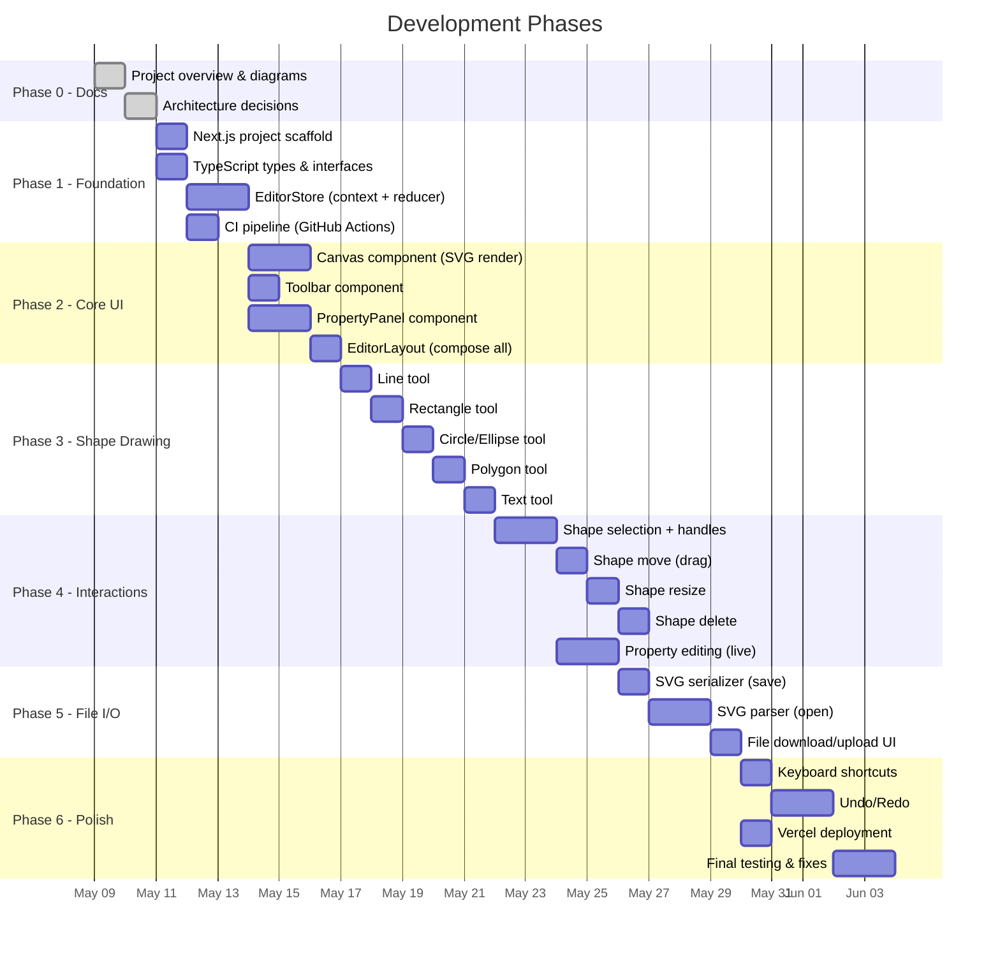

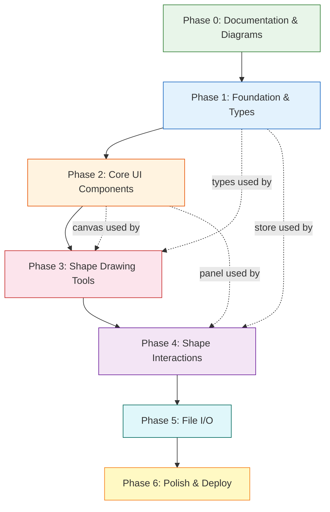
